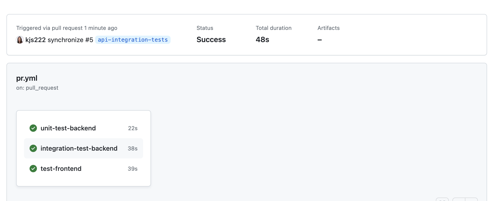

## Note

It may be easiest to read this README (with images) on Github: https://github.com/kjs222/congressional-app

### Overview

This application queries the ProPublica API daily for new senate and house votes. It does analysis on the recent votes and provides a front end application to display that information.

## Tech Stack

- React Typescript frontend
- Node Typescript backend
- Infrastructure as Code via AWS CDK
- Deployed on AWS (see details below on architecture)

## Architecture

- Deployed URL: http://kjs222-congressional-application.s3-website-us-east-1.amazonaws.com
- Repository: https://github.com/kjs222/congressional-app


Architecture is described below and depicted above. Application is deployed on AWS and is managed with IAC using AWS CDK.

- backend IAC: backend/lib/congressional-app-backend-stack.ts
- frontend IAC: frontend/infrastructure/lib/congressional-app-frontend-stack.ts

#### Data Persistence

The application uses AWS DynamoDB (no SQL) for the data persistence layer. Two tables support the application:

- congressDataCollectorRaw
- congressAnalyzedVotes

The schema is flexible on both tables. Type safety is imposed within the application using [zod](https://zod.dev/) schemas. All data coming in/out of the database is validated against those schemas for type safety.

See example data access here: backend/src/api/adapters/dynamo-analyzed-vote-repository.ts

I chose a no SQL database for a variety of reasons:

- the application is an MVP, and I will learn more about data access patterns as the application evolves. Changing schemas in this a No SQL datastore is trivial, compared to a SQL database. Once I understand access patterns better as the application evolves, it is possible that I will transition to a SQL datastore.
- the API aspect of the application is read-only, limiting some of the challenges I have encountered with no SQL in the past.
- the application uses an hexagonal design (aka ports and adapters) making the change of datastores relatively smooth.

#### Data Collector

- Deployed on: AWS Lambda (serverless)
- Invoked by: Scheduled AWS Event Bridge Event
- Code path: backend/src/data-collector
- Entry point: handler function in `backend/src/data-collector/handler.ts`

Purpose:

- makes API calls to ProPublica API to get recent congressional votes from the prior day
- persists the raw vote information in AWS Dynamo DB
- sends an event on AWS SQS for the data collector

##### Event Collaboration

To effectively decouple the data collector for the data analyzer (and allow them to scale independently), the collaboration between the two components is achieved through SQS events and queue. After the data collector persists raw votes obtained from the ProPublica API, it emits an event onto the SQS queue, which is picked up by the data analyzer.

#### Data Analyzer

- Deployed on: AWS Lambda (serverless)
- Invoked by: SQS Event
- Code path: backend/src/data-analyzer
- Entry point: handler function in `backend/src/data-analyzer/handler.ts`

Purpose:

- Perform analysis on raw data collected by data collector
- Persist analyzed data to be served up by API

#### API

- Deployed on: AWS Lambda (serverless) with AWS API Gateway (routing, etc)
- Invoked by: HTTP API
- Code path: backend/src/api
- Entry point: handler function in each file in the directory `backend/src/api/handlers`

Purpose:

- API for frontend application

#### Frontend

- Deployed on: AWS S3 Static Website
- Code path: frontend/src
- URL: http://kjs222-congressional-application.s3-website-us-east-1.amazonaws.com

A React application that interacts with the API described above to display analyzed vote information.

## CI/CD

CI/CD is implemented using Github Actions:

- CI Workflow: .github/workflows/pr.yml
- CD Workflow: .github/workflows/deploy.yml

#### CI

The CI workflow is initiated when a PR is opened against the `main` branch. It builds the application and runs all unit and integration tests.

See examples [here](https://github.com/kjs222/congressional-app/actions/workflows/pr.yml)




#### CD

The CD workflow is initiated on a push to main. It deploys the frontend and backend applications on AWS.

See examples [here](https://github.com/kjs222/congressional-app/actions/workflows/deploy.yml)


## Instrumentation + Metrics

Given that the application is entirely serverless, using Prometheus (requiring a server) seemed like an odd choice. Most production metrics tools (datadog, etc) have integration with AWS. If the application evolves, I would likely move to using one of those paid tools. But in the interim, AWS CloudWatch provides sufficient monitoring and instrumenting tools for the application.

See some examples below:


## Testing

The application contains both Unit and Integration tests.

Backend tests use the following testing frameworks:

- mocha with chai
- sinon for stubs, spies and mocks

### Unit Tests

Requirements:

- node - version 20, but likely lower versions work
- npm - should be installed with node

To run:

```
cd backend
npm install
npm run unit-test
```

##### Mocking

As indicated above, sinon is used for mocking.

See example usage here: backend/test/unit/api/vote-handler.spec.ts

### Integration Tests

Additional requirements:

- docker

To run:

```
cd backend
npm install
npm run integration-test-local
```

## To Run Locally

#### Frontend:

```
cd frontend
npm install
npm run start
```

Application will be at localhost:3000

I am not exposing the env variables needed to actually run the application however (sorry)

#### Backend

The backend application is a serverless application so there is no server to be run. The "handler" is the entry into each application component and it can conceivably be invoked.

Some things to note:

- to spin up a dockerized database

```
cd backend
npm install
npm run start-local-ddb
```

I am not exposing the env variables needed to actually run the application however (sorry)

#### Next features to add

I added an MVP frontend, but I would minimally like to add the following:

- A way to scroll to get more votes (right now it is just retrieving the last 20)
- A way to display vote analysis by the state of the member (this data exists on the backend, but hasn't been exposed on the frontend)
